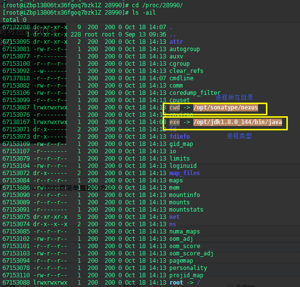

## 查看进程占用的端口号

ps -ef | grep qdp-monitor|grep -v grep|awk '{print $2}'

## 安装ping

apt-get install inetutils-ping


## 查看端口占用

netstat -ano | findstr 22

## 查看端口占用

首先用lsof -i:80看下80端口被什么程序占用

## linux命令行终端设置tab补全文件名或路径不区分大小写（大小写不敏感）

在 inputrc 文件中增加一行配置

```
echo "set completion-ignore-case on">>~/.inputrc
```

当前用户重新登录后生效(不用重启)

当然了，这只是改变当前用户的操作配置，如果要改变全局（对所有用户都生效）的配置，需要在 /etc/inputrc 文件中增加相同的配置，重启后生效。

```
vim /etc/inputrc

# 增加一行新的配置

set completion-ignore-case on

# 退出编辑 :wq

reboot
```

在 ~/.inputrc 文件(我的ubuntu 默认没有此文件，我新建的)里面加上如下两行:

```
"\e[A": history-search-backward
"\e[B": history-search-forward
```

能够让你在命令行输入字符之后，就可以用方向键Up，Down来搜索以该串字符开头的历史命令。


## Linux强制踢出用户命令

- 输入w命令查看已登录用户信息（或者who）

```
登陆用户信息说明：

USER：显示登陆用户帐号名。用户重复登陆，该帐号也会重复出现。

TTY：用户登陆所用的终端。

FROM：显示用户在何处登陆系统。

LOGIN@：是LOGIN AT的意思，表示登陆进入系统的时间。

IDLE：用户空闲时间，从用户上一次任务结束后，开会记时。

JCPU：一终端代号来区分，表示在摸段时间内，所有与该终端相关的进程任务所耗费的CPU时间。

PCPU：指WHAT域的任务执行后耗费的CPU时间。

WHAT：表示当前执行的任务。
```

- 使用命令pkill -kill -t 用户

```
pkill -kill -t pts/2
```

## Linux中怎么通过PID号找到对应的进程名及所在目录

- 首先需要知道PID号，可以通过top命令获取

然后我们可以用ps看以下大致信息（ps出来的信息个人觉得比较乱，不是很方便查找）

```
# ps -aux |grep -v grep|grep 28990
```

- 当然可以有别的更简单直接的方法.

　　得知PID之后可以直接进入/proc/28990

再输入 `ls -ail`




## 查看目录下有多少个文件及文件夹

ls | wc -w


## 查看目录下有多少个文件

ls | wc -c

## 查看文件夹下有多少个文件，多少个子目录

ls -l |wc -l

若只想知道文件的个数，则需在终端输入

ls -l |grep ^-|wc -l

## 

