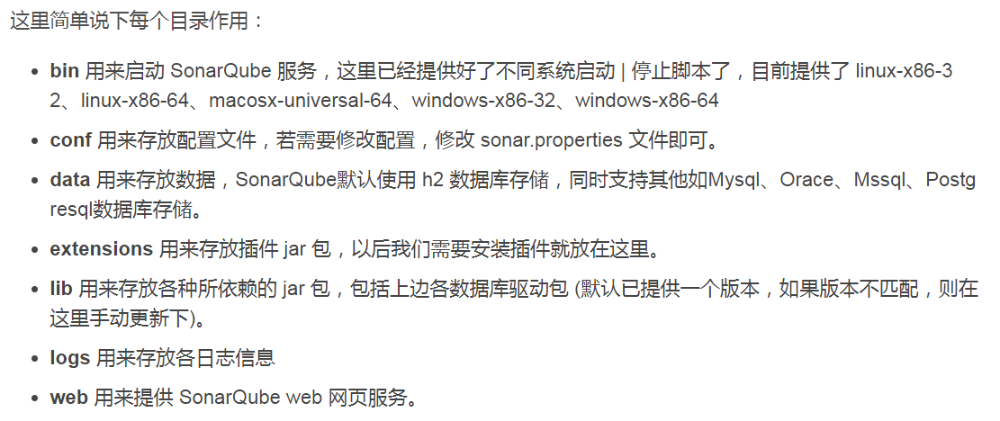
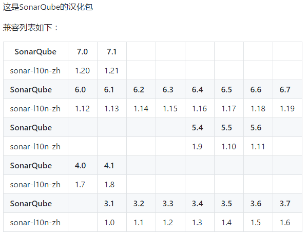

## 启动

docker run --name sonar -t -i -p 60026:22 -p 9000:9000 ubuntu:17.10 /bin/bash

## 安装ssh

apt-get update

apt-get install openssh*

## 安装vim等一系列命令


apt-get install vim zip iputils-ping net-tools


## 修改root密码

passwd root

## 设置root用户可以ssh远程连接

- 修改 /etc/ssh/sshd_config :

vi /etc/ssh/sshd_config

- 修改 #PermitRootLogin without-password
为 PermitRootLogin yes


- 重启 ssh  服务

service ssh restart

## 使用传输文件的命令： rz  sz
需要安装：  apt-get install lrzsz


## 安装java

- 上传jdk压缩包

- 设置环境变量

```

vim /etc/profile

>  export JAVA_HOME=/data/jdk
   export PATH=$PATH:$JAVA_HOME/bin

source /etc/profile
java -version

```


## 安装maven

- 上传压缩包
- 设置环境变量


```
vim /etc/profile

......
export M2_HOME=/data/apache-maven-3.5.2
export PATH=${M2_HOME}/bin:$PATH
......

使配置文件生效

source /etc/profile
mvn -version

```

## 安装Sonar

下载地址： https://www.sonarqube.org/downloads/


> sonar从5.6版本后就必须使用java8运行了，所以下载时需要注意版本，如果服务器安装的是jdk1.7，就下载5.5或者以前的版本。

> 如果你的服务器jdk版本是1.7，但还要用高版本sonar的话，可以修改sonar/conf/wrapper.conf，

>  wrapper.java.command=/sonar/jdk1.8.0_121/bin/java  //加入1.8jdk作为启动jdk


---

这里使用的是6.7.3版本。

下载下来的是一个压缩包`sonarqube-6.7.3.zip`，上传到服务器上

- 解压sonarqube-6.7.3.zip

```
unzip sonarqube-6.7.3.zip
```



- 启动

进入到`sonarqube-6.7.3/bin/linux-x86-64`目录，执行下面命令即可启动sonar：

```
sh sonar.sh start
```

启动日志可以去`sonarqube-6.7.3/logs`目录下查看。


```
如果是使用root用户启动的话会失败，查看日志可以看到： can not run elasticsearch as root，

需要创建一个新的用户，

adduser sonar
passwd sonar

- 授权

chown -R sonar sonarqube-6.7.3

- 切换到sonar用户再执行启动命令

su sonar

sh sonar.sh start
```

在浏览器输入http://ip:9000

看到如下界面表示成功


## 修改数据库为mysql


Sonar默认使用的是H2，但这个是不推荐的，因为它不可升级，不可迁移。


- 创建数据库sonar

```
CREATE DATABASE sonar CHARACTER SET utf8 COLLATE utf8_general_ci;

CREATE USER 'sonar' IDENTIFIED BY 'sonar';

GRANT ALL PRIVILEGES ON *.* TO 'sonar'@'%' IDENTIFIED BY 'sonar' WITH GRANT OPTION;

FLUSH PRIVILEGES;
```

- 修改Sonar的配置文件

进到conf目录

```
vim sonar.properties


# 只需修改username，password和url即可
sonar.jdbc.username=sonar
onar.jdbc.password=password
sonar.jdbc.url=jdbc:mysql://10.2.21.111:3306/sonar?useUnicode=true&characterEncoding=utf8&rewriteBatchedStatements=true&useConfigs=maxPerformance&useSSL=false

```


配置完成后，到bin目录下执行 `sh sonar.sh restart`，重启Sonar，再次打开界面，即可看到数据库已配置成功；


### 默认管理员账号密码为admin:admin


## 安装chinese插件（汉化）

登录后可以在Administration菜单下在线下载插件


- 离线安装

汉化包Chinese Pack的github地址：https://github.com/SonarQubeCommunity/sonar-l10n-zh

下载对应版本的jar包



将jar包拷贝到sonarqube的extensions/plugins目录下即可，重启sonarqube,即可看到中文界面


# 配置maven的settings.xml
打开maven所在目录的conf\settings.xml，添加如下内容：


```
<settings>		
	<!-- 这个节默认都有的，只需要添加pluginGroups和profile即可 -->    
	<pluginGroups>        
		<pluginGroup>
			org.sonarsource.scanner.maven
		</pluginGroup>    
	</pluginGroups>    

	<profiles>        
		<profile>            
			<id>sonar</id>            
			<activation>                
				<activeByDefault>true</activeByDefault>            
			</activation>            
			<properties>                
				<sonar.host.url>http://ip:9000</sonar.host.url>            
			</properties>        
		</profile>     
	</profiles>
</settings>
```

进入我们需要进行检查的工程所在目录，输入以下命令：

```
mvn clean install org.sonarsource.scanner.maven:sonar-maven-plugin:3.3.0.603:sonar
```

maven执行结束后，打开sonarqube，可以看到分析结果。


---
